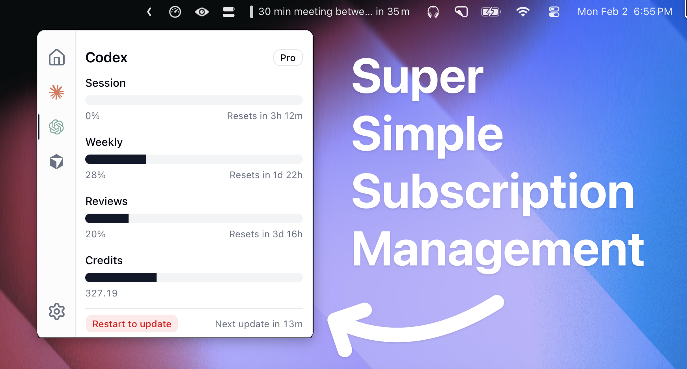

# OpenUsage for Windows

在 Windows 系统托盘中追踪你的 AI 编程订阅用量。

这是 [OpenUsage](https://github.com/robinebers/openusage) 的 **Windows 移植版**（基于开源 Tauri 版本）。可在托盘旁的面板中查看各 AI 编程套餐的用量：会话/周限额、额度与花费等。

> 上游项目：[robinebers/openusage](https://github.com/robinebers/openusage)（以 macOS 为主；`main` 为原生 Swift 版，`tauri-legacy` 为 Tauri 旧版）。



## 功能

- **系统托盘应用** — 点击托盘图标打开用量面板
- **提供商插件** — 支持 Claude、Codex、Cursor、Copilot、Grok 等
- **复用本机登录** — 读取用户目录下已有的认证文件，无需重复登录
- **本地 HTTP API** — `127.0.0.1:6736`，供其他工具与 Agent 读取
- **代理支持** — 通过 `~/.openusage/config.json` 配置 SOCKS5 / HTTP 代理
- **全局快捷键** — 可在任意界面切换面板显示
- **开机启动** — 可选登录后自动启动

## 支持的提供商

在 Windows 上，多数提供商在你已登录对应 CLI 或应用后即可使用：

| 提供商 | 凭据来源 |
|---|---|
| Claude | `~/.claude/.credentials.json` 或环境变量 `CLAUDE_CODE_OAUTH_TOKEN` |
| Codex | Codex CLI 认证目录 `%USERPROFILE%\.codex` / `$CODEX_HOME` |
| Cursor | Cursor 应用本地状态（若存在） |
| Copilot | 本机 GitHub / Copilot 登录 |
| Grok | 执行 `grok login` 后的 `~/.grok/auth.json` |
| OpenCode Go、Z.ai、Amp、Kimi、MiniMax 等 | 与上游相同的插件逻辑 |

仅依赖 macOS 钥匙串（Keychain）的登录在 Windows 上不可用；请改用对应 CLI 的文件式登录。

## 从源码安装

### 环境要求

- Windows 10/11
- [Node.js](https://nodejs.org/) 20+
- [Rust](https://rustup.rs/)（MSVC 工具链）
- 带「使用 C++ 的桌面开发」工作负载的 Visual Studio Build Tools
- WebView2（Windows 11 通常已预装；缺失时会走引导安装）

### 构建

```powershell
git clone https://github.com/chenzai666/openusage-windows.git
cd openusage-windows
npm install
npm run bundle:plugins
npm run tauri:build
```

安装包输出位置：

- `src-tauri\target\release\bundle\nsis\*.exe`
- `src-tauri\target\release\bundle\msi\*.msi`

### 开发模式

```powershell
npm install
npm run tauri:dev
```

## 使用方法

1. 先登录你的 AI CLI/应用（Claude Code、Codex、Cursor、Grok 等）。
2. 启动 OpenUsage — 图标会出现在系统托盘。
3. **左键**点击托盘图标打开仪表盘；**右键**打开菜单（设置、退出等）。

可选代理配置（`%USERPROFILE%\.openusage\config.json`）：

```json
{
  "proxy": "socks5://127.0.0.1:1080"
}
```

本地 API（仅本机回环）：

```text
GET http://127.0.0.1:6736/v1/usage
```

## 架构

- **前端：** React + TypeScript + Vite + Tailwind（面板 UI）
- **后端：** Rust + Tauri 2（托盘、插件、本地 HTTP API）
- **提供商：** `plugins/` 下的 JavaScript 插件，在嵌入式 QuickJS 中运行

相对上游 Tauri 版的 Windows 适配：

- 用标准「始终置顶 + 贴托盘」窗口替代 macOS `NSPanel`
- 禁用 macOS 私有 API / App Nap / WebKit 相关调整
- 路径展开支持 Windows 用户主目录
- 打包 NSIS + MSI 安装程序

## 致谢

- 原作者 [Robin Ebers](https://github.com/robinebers) — [openusage](https://github.com/robinebers/openusage)
- 灵感来源 [CodexBar](https://github.com/steipete/CodexBar)

## 许可证

[MIT](LICENSE) — 与上游 OpenUsage 相同。
